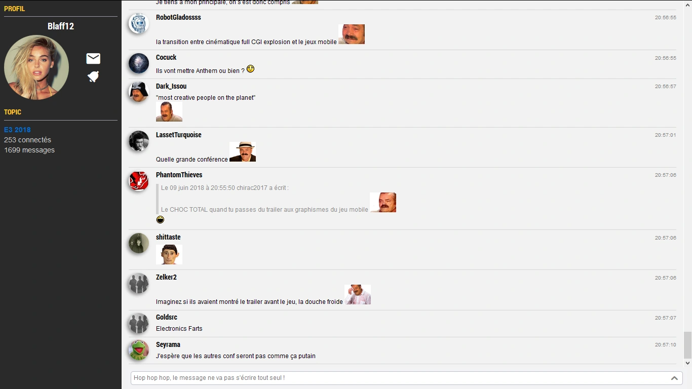

# **JVChat Premium** - Fork

### _Outil de discussion instantanée pour les forums de Jeuxvideo.com_

## Aperçu

## A propos

### Auteur du script : **Blaff**

### Mainteneur : **Rand0max**

### Dernière version : **0.2.3 - 30/04/2026**

## Changelog

### 0.2.3 — 30/04/2026
- Détection automatique des blocs externes Deboucled/Décensured, RisiBank et du sondage natif du forum
- Nouveau toggle inline (chevron en haut à droite du bloc) pour replier/déplier chaque bloc, avec persistance dans la configuration
- Les 3 blocs sont masqués par défaut à l'activation de JVChat
- Le bouton de toggle s'adapte automatiquement au thème clair/sombre du forum

### 0.2.2 — 28/04/2026
- Correction erreur lors de l'activation et correction des citations

### 0.2.1 — 18/04/2026
- Correction des citations

### 0.2.0 — 17/04/2026
- Support complet de la refonte des forums JVC 2026

## TODO (Blaff)

- Smooth transition on append messages (slide-in plutôt que jump)
- Détection captcha
- Bouton actualiser les messages (+ afficher le delai courrant d'actualisation)
- Notification avec @pseudo
- Blacklist
- Pouvoir voir les anciens messages
- La leftbar ne se rétrécie pas si le titre du topic n'a pas d'espaces
